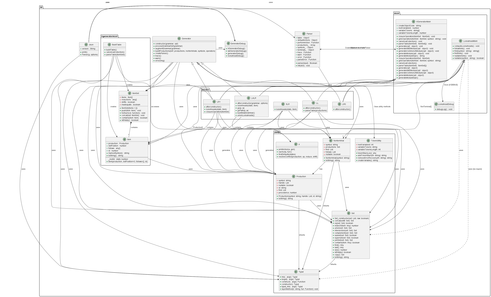

Software Re-Engineering Project
Jison is an open-source codebase. This repository includes the original class diagram of Jison as well as the refactored class diagram.

Features
Refactoring Techniques Applied:

Replace Conditional with Polymorphism:
The switch statement in the main Jison file, which was used for parser generation, has been replaced with a polymorphic lookup table. The parser generator classes are now dynamically accessed from the parsers object based on the opt.type, eliminating the need for explicit conditional logic.

Moving Features Between Objects:

Move Method and Extract Class were applied to different parts of the code for better modularity and readability.

Extracted Functionality:

Extracted parser functionality into a separate file.

Extracted generator functionality.

Extracted non-terminal functionality.

Extracted production functionality.

Extracted LookaheadMixin functionality.

Extracted LookaheadGenerator functionality.

Extracted Parser Types (LR0, LR1, SLR, LALR, LL):
The parser types (lalr.js, ll.js, lr0.js, etc.) were extracted from the Jison file to improve code readability, modularity, and maintainability. This change aligns the code more closely with the Single Responsibility Principle (SRP), Open/Closed Principle (OCP), and Dependency Inversion Principle (DIP).

Modified Mixingenerator:
Refactoring of the mixingenerator to improve the overall code design.

Extracted Token Logic:
Methods like token addition, removal, and creation were moved into separate files for better code organization.

Extracted Common Functions:
Common functionality shared across different parts of the code was extracted into dedicated modules.

Extracted Build Table Logic:
Refactoring to modularize the logic used to build the parsing tables.

Duplicate Code Refactoring:
Duplicate operations (such as traversing productions) were refactored by extracting common methods into a separate file for better maintainability.

Class Diagrams
Original Diagram

Refactored Diagram

How to Use the Project
Step 1: Clone the repository using the command:

bash
Copy
Edit
git clone https://github.com/your-username/repository-name.git
Step 2: Install dependencies:

bash
Copy
Edit
npm install
Step 3: Run the project:

bash
Copy
Edit
npm start
This should make the README file clearer, more readable, and more consistent. Let me know if you'd like further adjustments!

## Original Diagram

## Refactored Diagram
How to use the project.

